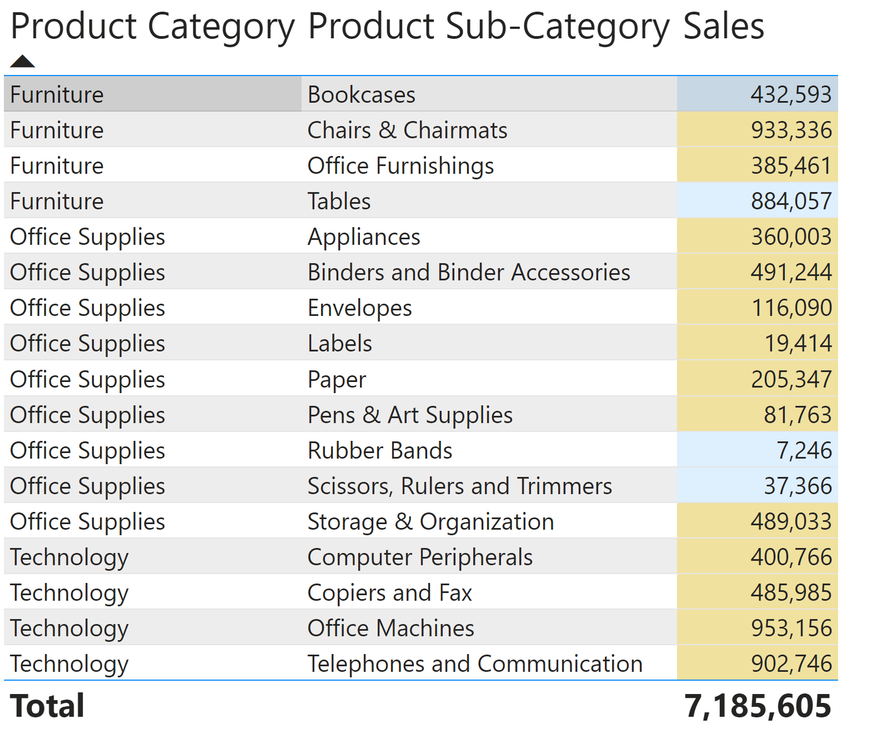

# Sales and Customer Analysis Power BI Dashboard
Analysis of sales, customer behavior, and profitability using Power BI to provide interactive insights into order patterns, shipping costs, and regional performance through comprehensive data visualization.
# Objective
The objective of this project was to analyze sales and customer data from a retail business to gain actionable insights into order patterns, customer loyalty, profitability, and shipping efficiency across different regions and product categories. By applying various data processing and visualization techniques, the project aimed to provide a comprehensive dashboard that enables stakeholders to explore key performance metrics and support data-driven decision-making.

# Data Preparation and Transformation
The dataset used in this project was sourced from an Excel file containing multiple sheets, including orders, returns, and user information. The data preparation process was carried out in Power Query Editor and involved several key steps to ensure data consistency, accuracy, and usability for analysis. This phase involved consolidating multiple order records into a single dataset, removing redundant and irrelevant fields to streamline the dataset and improve performance, standardizing categorical values and dealing with missing values by either replacing them with appropriate values or removing incomplete records. 

Data aggregation techniques were employed to summarize business performance at various levels. The dataset was grouped by region and customer segment to calculate key performance indicators such as the number of orders, total profit, and average profit per order. Customer segmentation was applied to categorize customers into key groups such as high-value and repeat customers. A dynamic filtering system using parameters was implemented to allow users to analyze order priorities (Low, Medium, High, Critical). 

# Visualization
Data loading optimization techniques were applied by excluding non-essential queries from the data model and the next step involved structuring the information in a way that made it easier to explore and interpret. To achieve this, grouping of shipping modes was created to categorize shipments as either Air or Ground, providing a higher-level overview of logistics. Additionally, a hierarchy was built from product categories and subcategories to facilitate drill-down analysis.

Sales page contains table visualization created to present total sales for different product categories and subcategories. Conditional formatting was introduced to the Sales column to highlight positive and negative profit trends using color coding.

Next dashboard page called Shipping Cost features a bubble chart to visualize the relationship between total sales and average shipping costs across product categories and shipment modes, with profit represented by bubble size. The chart was enhanced with differentiated colors and shapes for various shipping modes, and animations were added to observe trends over time. A horizontal bar chart allows users to analyze average shipping costs across product categories, customer segments, or order priorities, providing an interactive experience through parameter-driven filtering.

A Profit dashboard page allows the user to observe data for different customer segments and provids a view of profitability across different dimensions. A matrix visualization was created to showcase total profits by product category and shipment mode, sorted in descending order to highlight key revenue drivers. The matrix allows users to expand and drill down through hierarchical levels. A geographic map visualization was introduced to display total profit distribution across states, utilizing color gradients to depict variations in profitability. Additionally, a column chart was added to track total profit and average shipping costs over time, enabling users to drill down from years to months.

To further enhance interactivity, additional pages such as Tooltip and Drillthrough were implemented. The Tooltip page featured a column chart displaying average shipping costs by product sub-category, which could be accessed by hovering over visual elements in other pages. The Drillthrough page enabled users to click on specific product categories and navigate to a dedicated view displaying detailed cost breakdowns and key metrics. Filters were applied across all pages to exclude records with unspecified order priorities, ensuring cleaner and more accurate analysis.

The final dashboard provides a comprehensive, interactive interface for analyzing sales, customer behavior, and profitability trends. Users can explore insights by interacting with visual elements, applying filters, and utilizing drill-through capabilities to dive deeper into key performance metrics.

